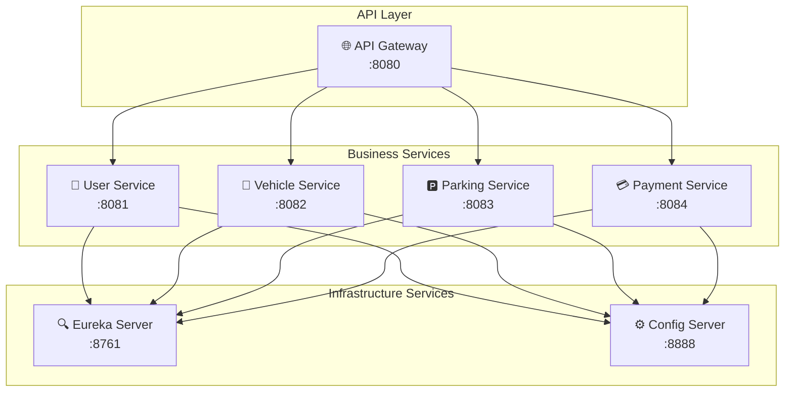
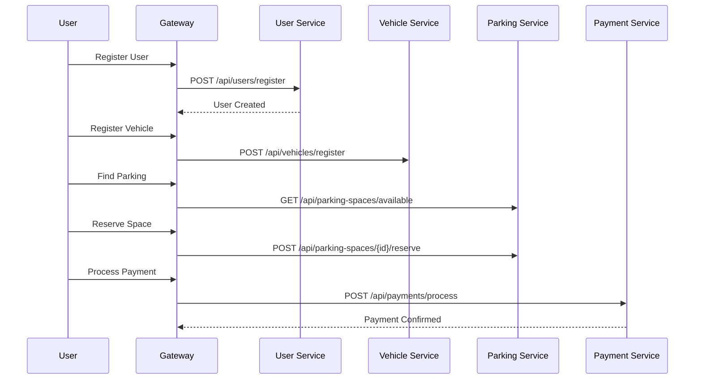

# 🚗 Smart Parking Management System (SPMS)

<div align="center">


**A Cloud-Native Microservices Platform for Urban Parking Solutions**

[](https://openjdk.org/)
[](https://spring.io/projects/spring-boot)
[](https://microservices.io/)
[](LICENSE)

[🚀 Quick Start](#-quick-start) • [📋 Features](#-features) • [🏗️ Architecture](#%EF%B8%8F-architecture) • [📚 API Docs](#-api-documentation) • [🔄 Contributing](#-contributing)

</div>

---

## 🌟 Overview

SPMS revolutionizes urban parking through intelligent space management, real-time monitoring, and seamless user experiences. Built with modern microservices architecture, it addresses critical urban mobility challenges while providing scalable, maintainable solutions.

### ✨ Key Highlights

- 🎯 **Real-time Availability**: Instant parking space status updates
- 💳 **Smart Payments**: Multiple payment methods with automated processing  
- 🏗️ **Microservices Ready**: Scalable, cloud-native architecture
- 📱 **Multi-platform**: RESTful APIs for web, mobile, and IoT integration
- 🔍 **Service Discovery**: Auto-registration and health monitoring

---

## 🏗️ Architecture

<div align="center">



</div>

### 🔧 Technology Stack

<table align="center">
<tr>
<td align="center"></td>
<td align="center"></td>
<td align="center"></td>
</tr>
<tr>
<td align="center"></td>
<td align="center"></td>
<td align="center"></td>
</tr>
</table>

---

## 📋 Features

<div align="center">

| 👥 **User Management** | 🚗 **Vehicle Tracking** | 🅿️ **Space Management** | 💳 **Payment Processing** |
|:---:|:---:|:---:|:---:|
| Multi-role support | Real-time entry/exit | Dynamic availability | Secure transactions |
| Profile management | Multiple vehicle types | Smart reservations | Auto-fee calculation |
| Authentication | Usage analytics | Location filtering | Digital receipts |

</div>

### 🎯 Core Capabilities

#### 👤 User Management
- **Multi-Role System**: Customer, Parking Owner, Admin roles
- **Profile Management**: Complete user lifecycle management
- **Secure Registration**: Validation and authentication

#### 🚗 Vehicle Operations  
- **Smart Tracking**: Real-time vehicle entry/exit simulation
- **Multi-Type Support**: Cars, motorcycles, vans
- **Usage Analytics**: Comprehensive tracking and reporting

#### 🅿️ Parking Intelligence
- **Dynamic Availability**: Real-time space status updates
- **Smart Reservations**: Advance booking capabilities
- **Location Services**: GPS-based space discovery
- **Multi-Type Spaces**: Standard, compact, disabled, EV charging

#### 💳 Payment Excellence
- **Multiple Methods**: Credit/debit cards, digital wallets, cash
- **Auto-Calculation**: Dynamic pricing with tax computation
- **Digital Receipts**: Instant receipt generation
- **Refund Processing**: Automated refund handling

---

## 🚀 Quick Start

### 📋 Prerequisites

<div align="center">


</div>

### ⚡ Installation

```bash
# 📥 Clone the repository
git clone https://github.com/Kaif_Zakey47/Smart_Parking_Management_System.git
cd Smart_Parking_Management_System

# 🔄 Start services in order
```

### 🎬 Service Startup Sequence

<details>
<summary>📖 Expand startup commands</summary>

```bash
# 1️⃣ Infrastructure Layer
cd eureka-server && mvn spring-boot:run &
cd config-server && mvn spring-boot:run &

# 2️⃣ API Gateway
cd api-gateway && mvn spring-boot:run &

# 3️⃣ Business Services (parallel startup)
cd user-service && mvn spring-boot:run &
cd vehicle-service && mvn spring-boot:run &
cd parking-space-service && mvn spring-boot:run &
cd payment-service && mvn spring-boot:run &
```

</details>

### 🌐 Service Endpoints

| Service | Port | Status | Purpose |
|---------|------|--------|---------|
| 🔍 **Eureka Server** | `8761` |  | Service Registry |
| ⚙️ **Config Server** | `8888` |  | Configuration Hub |
| 🌐 **API Gateway** | `8080` |  | Request Router |
| 👤 **User Service** | `8081` |  | User Management |
| 🚗 **Vehicle Service** | `8082` |  | Vehicle Operations |
| 🅿️ **Parking Service** | `8083` |  | Space Management |
| 💳 **Payment Service** | `8084` |  | Payment Processing |

### ✅ Health Verification

```bash
# 🔍 Check Eureka Dashboard
curl http://localhost:8761

# 🌐 Verify API Gateway
curl http://localhost:8080/actuator/health

# 🎯 Test all services
curl http://localhost:808{1,2,3,4}/actuator/health
```

---

## 📚 API Documentation

<div align="center">

[](./Smart-Parking-Management-System-Microservice-Based-Application/spms_postman_collection.json)

</div>

### 🎯 Core Endpoints

<details>
<summary>👤 User Service API</summary>

| Method | Endpoint | Description |
|--------|----------|-------------|
| `POST` | `/api/users/register` | 📝 Register new user |
| `GET` | `/api/users` | 📋 Get all users |
| `GET` | `/api/users/{userId}` | 🔍 Get user details |
| `PUT` | `/api/users/{userId}` | ✏️ Update user info |

</details>

<details>
<summary>🚗 Vehicle Service API</summary>

| Method | Endpoint | Description |
|--------|----------|-------------|
| `POST` | `/api/vehicles/register` | 🚗 Register vehicle |
| `GET` | `/api/vehicles/user/{userId}` | 📋 Get user vehicles |
| `POST` | `/api/vehicles/{vehicleId}/entry` | 🚪 Vehicle entry |
| `POST` | `/api/vehicles/{vehicleId}/exit` | 🚪 Vehicle exit |

</details>

<details>
<summary>🅿️ Parking Service API</summary>

| Method | Endpoint | Description |
|--------|----------|-------------|
| `POST` | `/api/parking-spaces/create` | ➕ Create parking space |
| `GET` | `/api/parking-spaces/available` | 🔍 Get available spaces |
| `POST` | `/api/parking-spaces/{spaceId}/reserve` | 📅 Reserve space |
| `GET` | `/api/parking-spaces/stats` | 📊 Get statistics |

</details>

<details>
<summary>💳 Payment Service API</summary>

| Method | Endpoint | Description |
|--------|----------|-------------|
| `POST` | `/api/payments/process` | 💳 Process payment |
| `POST` | `/api/payments/calculate-fee` | 🧮 Calculate fees |
| `GET` | `/api/payments/{paymentId}/receipt` | 🧾 Get receipt |
| `POST` | `/api/payments/{paymentId}/refund` | 💰 Process refund |

</details>

---

## 🧪 Testing & Monitoring

### 🔬 Test Categories

- **🏥 Health Checks**: Service availability monitoring
- **🎯 Direct Testing**: Individual microservice validation  
- **🌐 Gateway Testing**: Request routing verification
- **🔄 End-to-End**: Complete workflow simulation

### 📊 Monitoring Dashboard

Access the Eureka Dashboard for real-time service monitoring:

```
http://localhost:8761
```

<div align="center">


</div>

---

## 🎯 Sample Workflow



---

## 🚀 Future Roadmap

<div align="center">

| Phase | Features | Timeline |
|-------|----------|----------|
| 🎯 **Phase 1** | IoT Sensor Integration | Q2 2025 |
| 📱 **Phase 2** | Mobile Application | Q3 2025 |
| 🤖 **Phase 3** | AI-Powered Analytics | Q4 2025 |
| 🌍 **Phase 4** | Smart City Integration | Q1 2026 |

</div>

### 🔮 Upcoming Features

- 📡 **IoT Integration**: Real-time sensor data processing
- 📱 **Mobile Apps**: Native iOS and Android applications  
- 🤖 **Machine Learning**: Demand prediction and optimization
- 🗺️ **Smart Maps**: Interactive parking visualization
- 🚦 **Traffic Integration**: City-wide traffic management sync

---

## 🔄 Contributing

<div align="center">

[](CONTRIBUTING.md)

</div>

We welcome contributions! Here's how to get started:

1. 🍴 **Fork** the repository
2. 🌿 **Create** a feature branch (`git checkout -b feature/amazing-feature`)
3. ✨ **Commit** your changes (`git commit -m 'Add amazing feature'`)
4. 📤 **Push** to the branch (`git push origin feature/amazing-feature`)
5. 🎯 **Open** a Pull Request

### 📋 Contribution Guidelines

- Follow existing code style and patterns
- Add tests for new features
- Update documentation as needed
- Ensure all tests pass before submitting

---

## 👨‍💻 About

<div align="center">

**Built with ❤️ by [Kaif Zakey](https://github.com/Kaif-Zakey47)**

🎓 **Academic Project** | ITS 1018 – Software Architectures & Design Pattern  
🏫 **Institution**: IJSE - Graduate Diploma in Software Engineering

[](https://github.com/Kaif-Zakey47)

</div>

---

## 📄 License

<div align="center">

[](LICENSE)

This project is developed as part of an academic assignment for the Graduate Diploma in Software Engineering program.

</div>

---

<div align="center">


</div>
